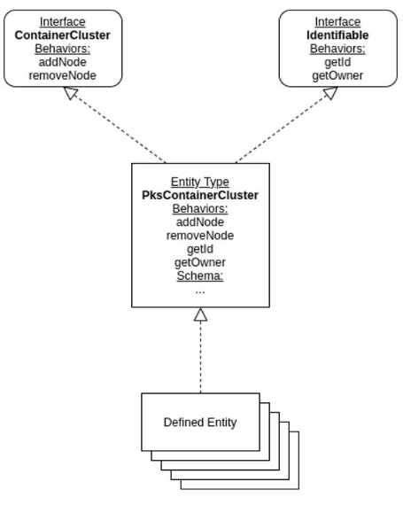

# Runtime Defined Entities Framework

## Introduction

The Cloud Director extensibility framework can be used in many different
ways, for example:

- Clients can add custom functionality to Cloud Director that addresses
their specific use cases

- ISVs can create extensions that tightly integrate their software with
Cloud Director

- Third Parties can create and distribute extensions offering new
value-added functionality

- Service Providers could deliver new differentiating capabilities to
their customers

Runtime Defined Entities can greatly simplify the development of
extensions by providing a built-in state management mechanism and the
definition of custom operation execution functionality within Cloud
Director.

Cloud Director supports several pre-defined entity types – VMs, vApps,
Networks, etc. The Runtime Defined Entities (RDE) functionality allows
clients to define their own custom entity types with custom
functionality.

## Typical RDE Uses

Several typical ways RDEs can be used by extensions are the following:

- Represent an external resource, for example a Container Cluster, and keep references to its resources in a strongly typed JSON document. (c.f. [Defined Entity Type schema](defined-entity-types.md))

- Persist the state of an Extension without the need of an external database. (c.f. [Defined Entities](defined-entities-lifecycle.md))

- Use the RDE Access Control mechanisms to manage the users’ access to
resources. (c.f. [RDE Access Control](rde-access-control.md))

- Use RDE instances as a Desired State interface to an external system.
(c.f. [Field-level Access Control](rde-access-control.md#field-level-rde-access-contol-and-encryption))

RDEs also provide a powerful [versioning mechanism](rde-versions.md), thus simplifying
the management of the extensions’ lifecycle, especially when used in the
context of [Solution Add-Ons](../../extension-sdk/extension-sdk.md).

## Runtime Defined Entities Concepts

A Runtime Defined Entity (RDE) is a package that contains a JSON payload.

Each RDE is an instance of an [RDE Type](defined-entity-types.md) that specifies
the format of the JSON payload using a JSON Schema.

An RDE Type may implement a number of [RDE Interfaces](defined-interfaces.md) that categorize it
conceptually, for example – “Container Cluster”. An RDE Interface may
also define [RDE Behaviors](behaviors-general-concepts.md) that can be executed on RDEs that implement it.

[RDE Behaviors](behaviors-general-concepts.md) are custom executable operations that can be performed on a
Runtime Defined Entity. Behaviors can be defined by clients via several
different mechanisms. RDE Types can be configured to automatically
execute specific Behaviors on certain events during the RDE lifecycle.

RDE Types, their RDE instances, as well as RDE Interfaces are [versioned](rde-versions.md).
They ensure that the schema of an RDE does not change once it is created. They also offer a path to transfer to other versions.

### Strict Tenancy

Runtime Defined Entities follow a strict tenancy model.

An RDE created in a specific tenant cannot be moved to another tenant.
Access to the RDE cannot be shared with users outside the tenant.

## Links to the RDE Components Documentation

- [RDE Interfaces](defined-interfaces.md)
- [RDE Types](defined-entity-types.md)
- [RDE Lifecycle](defined-entities-lifecycle.md)
- [RDE Operations](defined-entity-operations.md)
- [RDE Behaviors](behaviors-general-concepts.md)
- [RDE Access Control](rde-access-control.md)
- [RDE Versioning](rde-versions.md)
